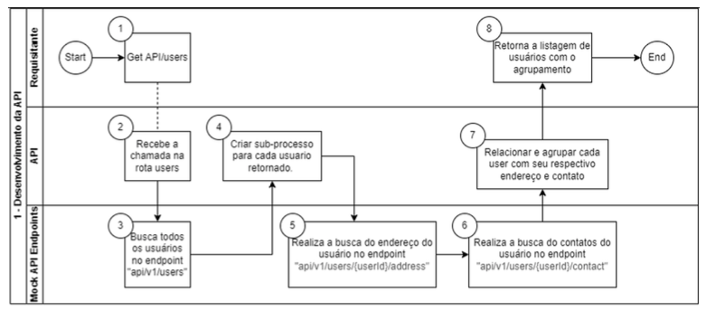
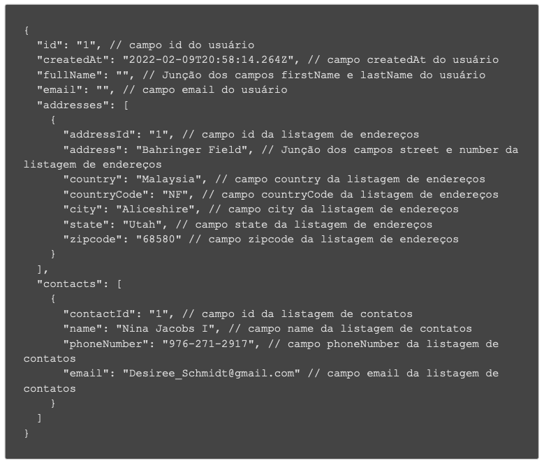
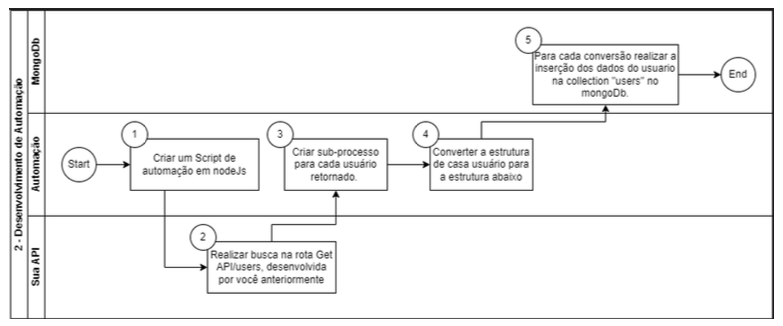
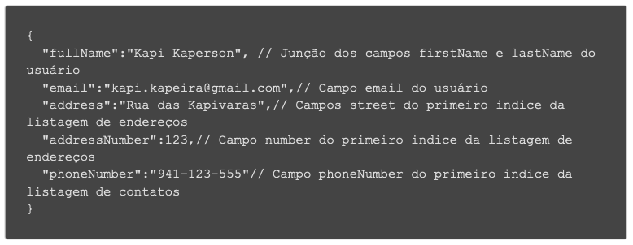

<h1 align="center">
  
</h1>

<h3 align="center">
  Desafio Técnico LinkApi - Junior

</h3>

<br>

## 👌 Requeridos

- [Node.js](https://nodejs.org/en/)
- [Yarn](https://classic.yarnpkg.com/) ou [npm](https://www.npmjs.com/)

### Clone o projeto e acesse a pasta

```sh
$ git clone https://github.com/edjust/desafio-linkapi.git && cd desafio-linkpi
```

## 📄 Sobre o projeto 1

### Objetivo

Construção de uma API RESTful usando a tecnologia NodeJS.

### Fluxograma

<h1 align="center">
  
</h1>

### Endpoints

1. Construir uma API RESTful que receba uma chamada simples e realizar a listagem de usuários do serviço MockApi conforme os passos posteriores.
2. Deverá ser feita uma requisição para o serviço MockApi realizando a listagem de usuários através da rota GET /users
3. Com a resposta da requisição anterior, deverá ser criado um subprocesso para cada usuário retornado.
4. Para cada usuário retornado, deverá ser feita uma chamada na seguinte rota para resgatar o endereço: "/users/{userId}/address".
5. Para cada usuário retornado, deverá ser feita uma chamada na seguinte rota para resgatar os contatos: "/users/{userId}/contact".
6. As informações de contato e endereço deverão ser agrupadas junto ao seu respectivo usuário.
7. Sua API por fim deverá retornar ao requisitante os usuários com as respectivas informações (informações base do usuário retornadas na listagem de usuários + lista de endereços + lista de contatos).
   2/6
8. O endpoint deverá retornar uma lista com o seguinte payload para cada usuário:

<h1 align="center">
  
</h1>

### Parâmetros de paginação

Esta api suporta parâmetros de paginação que podem ser utilizados através da queryString para realizar a listagem completa de dados:

- page: Número da pagina a ser buscada
- limit: Quantidade de elementos a serem retornados por página

Exemplo de utilização:
GET /users?page=1&limit=10

<br>

### Parâmetros de ordenação

Esta api suporta parâmetros de ordenação que podem ser utilizados através da queryString:

- sortBy: Campo que será considerado na ordenação de dados

- order:Ordem de classificação (asc ou desc)

Exemplo de utilização:
GET /users?sortBy=createdAt&order=desc

### Siga os pasos abaixo

```sh
# Instalar dependências
$ yarn

# Faça uma cópia do '.env.example' para '.env'
# e defina com SUAS variáveis de ambiente.
$ cp .env.example .env

# Para finalizar, execute o serviço API
$ yarn dev:server
```

## 🔨 Teste com Insomnia

[](https://insomnia.rest/run/?label=Teste%20LinkApi&uri=https%3A%2F%2Fraw.githubusercontent.com%2Fedjust%2Fdesafio-linkapi%2Fmaster%2FInsomnia.json%3Ftoken%3DGHSAT0AAAAAABUTSYEIUJMPMJLA5RUHX3MIYUDPCFA)

<br>

## 📄 Sobre o projeto 2

### Objetivo

Desenvolvimento de uma automação em NodeJs.

### Fluxograma

<h1 align="center">
  
</h1>

### Requisitos

1. Criar um Script de automação em NodeJs, com as regras de negócio e funcionalidade dos steps posteriores.
2. Seu script deverá inicialmente realizar a busca de todos os usuários na API que foi desenvolvida anteriormente.
3. Com a resposta da requisição anterior, deverá ser criado um subprocesso para cada usuário retornado.
4. Converter a estrutura de cada usuário para a estrutura abaixo:

<h1 align="center">
  
</h1>

5. Criar banco de dados Mongo, feito isso deverá ser criada uma collection chamada "users" para inclusão dos usuários. Portanto para cada conversão realizar a inserção dos dados do usuário na collection “users”.

### Siga os pasos abaixo

```sh
# Crie uma instância do mongoDB usando o docker
$ docker run --name mongodb -p 27017:27017 -d -t mongo

# Para finalizar, execute o script de automação
$ yarn automation
```
